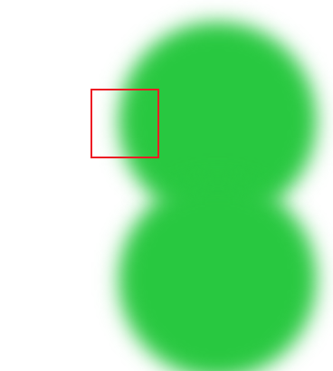
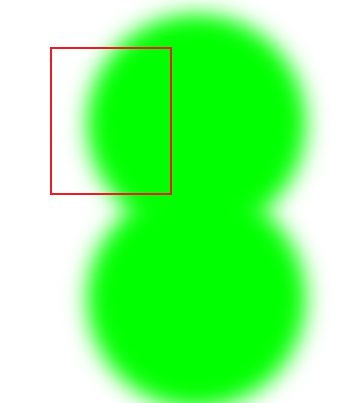
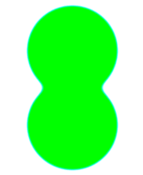
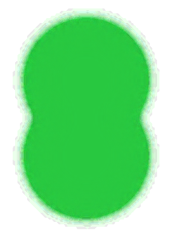
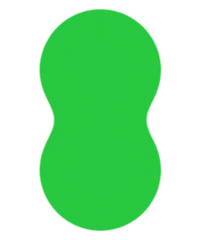

## 交融动画实现

#### 1、实现方式

交融动画实现方式有两种：

* 对比度
*  基于alpha(推荐) => 透明度


#### 2、对比度

> 交融效果，使用对比度方式，以黑白色实现效果会高于其他颜色。如果是其他颜色，不推荐使用，推荐使用alpha。

对比度是基于亮度的算法。

```html
<!DOCTYPE html>
<html lang="en">
<head>
    <meta charset="UTF-8">
    <meta name="viewport" content="width=device-width, initial-scale=1.0">
    <title>Document</title>
    <style>
        .container{
            display: flex;
            flex-direction: column;
            align-items: center;
            padding: 100px;
            /* 父元素进行对比度处理 默认值为1 */
            filter: contrast(10);
            background-color: #fff;
        }
        .ball{
            width: 100px;
            height: 100px;
            border-radius: 50%;
            background-color: #28c840;
            /* 小球模糊操作 */
            filter: blur(5px);
        }

        .ball:last-child{
            /* 最后一个元素，向上移动20px */
            margin-top: -20px;
        }
    </style>
</head>
<body>
    <div class="container">
        <div class="ball"></div>
        <div class="ball"></div>
    </div>
</body>
</html>
```

在上面的代码中，我们首先通过`filter: blur(5px)`给小球添加一个模糊半径.



小球受到模糊半径的影响，边缘带有透明和绿色的融合色，如果我们要实现交融效果，无非就是把这种淡绿色的颜色加深。

这个时候我们就可以通过`filter:contrast(1)`来调整对比度。随着对比度比例大小增大，小球颜色明暗对比就会更加明显。



如上图，虽然我们调整对比度让颜色变亮了，但是小球的边缘还是存在模糊现象。我们可以给父元素背景色设置为`#fff`来解决这个问题。



通过`对比度`方式，最终两个小球的交融效果也就实现了。

虽然最终我们是把效果完成了，但是还留有两个问题：

* 为什么调整对比度，小球颜色发生变化？

> 对比度是基于亮度的算法，也就是说对比度比例调整，小球颜色也会变得越来越亮，颜色也自然发生了变化。
>
> 同时，这也是这种方式的缺陷。如果某些交融效果不允许颜色发生变化，这种方案则会被out。

* 为什么要把父元素背景色设置为`#fff`，小球边缘不会模糊，不设置背景色会产生模糊现象？

> 对比度算法是基于亮度的，它**不会改变颜色的透明度**。除此之外，我们需要明白什么是模糊？
>
> 模糊：小球边缘的颜色，取决于内部的颜色和外部的颜色。如果说小球外部的颜色是透明的，就会导致边缘区域有些点是绿色的，有些点是半透明绿色的(这是因为绿色的像素点和透明像素点混合也开始变得透明了)，所以我们就会看到这样的模糊效果。
>
> 在这个基础上，我们进行加深它的对比度行为，由于这个对比度不会改变颜色的透明度，所以边缘区域依然模糊。
>
> 但是如果说我们把背景色设置为`#fff`，它的边缘区域就是白色跟绿色的混合了，它始终是不透明的。在不透明的基础上来加深对比度，才能够实现边缘的平滑。

注意：对比度实现交融效果，不推荐对背景色除黑白之外的颜色使用。


#### 3、基于alpha

> 交融效果，并且保持原色彩，就可以使用该方式。

```html
<!DOCTYPE html>
<html lang="en">
<head>
    <meta charset="UTF-8">
    <meta name="viewport" content="width=device-width, initial-scale=1.0">
    <title>Document</title>
    <style>
        .container{
            display: flex;
            flex-direction: column;
            align-items: center;
            padding: 100px;
			filter:;
            background-color: #fff;
        }
        .ball{
            width: 100px;
            height: 100px;
            border-radius: 50%;
            background-color: #28c840;
        }

        .ball:last-child{
            /* 最后一个元素，向上移动20px */
            margin-top: -20px;
        }
    </style>
</head>
<body>
    <div class="container">
        <div class="ball"></div>
        <div class="ball"></div>
    </div>
    <svg style="display: none;">
            <defs>
                <filter id="blob">
                    <!-- 高斯模糊算法 -->
                    <feGaussianBlur in="SourceGraphic" stdDeviation="10" result="blur"></feGaussianBlur>
                    <!-- 透明度算法：这里需要把矩阵计算搞明白 -->
                    <feColorMatrix in="blur" mode="matrix" values="
                                1 0 0 0 0
                                0 1 0 0 0 
                                0 0 1 0 0 
                                0 0 0 20 -10
                     "></feColorMatrix>
                </filter>
            </defs>
    </svg>
</body>
</html>
```

这一种方式，我们主要是通过`svg`来实现的，并在svg中定义了一个过滤器。

过滤器的本质就是一系列函数：

```
filter:
	f1
	f2
	f3
颜色 => f1 => f2 => f3 => xxx颜色
```

将某一个像素点的颜色传递给filter，他会经过上面所示阶段`f1=>f2=>f3`，得到最终的一个计算之后的颜色。只是每一个函数算法我们可以设定的不一样。

首先，经过高斯模糊算法之后，我们会得到两个小球模糊交融的图像。


这里小球的边缘区域也是得到了一个半透明的绿色，所以才会变得很模糊。因此，这里如果我们想要不改变原色彩，只能去改变其透明度 => 让那些不透明的变得透明。

通过下面的算法可以实现原色彩不变，透明度发生改变。

```html
<feColorMatrix 
in="blur" 
mode="matrix"
values="
1 0 0 0 0
0 1 0 0 0 
0 0 1 0 0 
0 0 0 20 -10
"></feColorMatrix>
```

上面这个矩阵算法是一个4*5的矩阵，分别表示的意思如下：

```
1 0 0 0 0		R
0 1 0 0 0 		G
0 0 1 0 0 		B
0 0 0 20 -10	A
```

利用原来颜色RGBA和上面这个矩阵相乘得到一个新的RGBA。

计算结果如下：

```
R1 = R
G1 = G
B1 = B
A1 = 20A - 10
```

如果说矩阵为下面这样：

```
1 0 0 0 0		
0 1 0 0 0 		
0 0 1 0 0 		
0 0 0 1 0
```

那么计算的结果和原理的RGBA是一样的，没有任何变化。

如果说，我们在下面所示位置给它加20倍，会出现什么效果？

```
1 0 0 0 0		
0 1 0 0 0 		
0 0 1 0 0 		
0 0 0 20 0
```

原来有些半透明的地方就会变得不透明。



由上图所示，不透明的范围变大导致了小球的范围也扩大了。但是这里还有一个问题，上图中边缘出现有一些噪点，这里的噪点和前面的高斯模糊算法有关。

从上图的边缘区域来看，出现有一些像素点透明，一些不透明的情况。如果我们想要让边缘变得平滑，就可以试着把边缘区域去除：

```
1 0 0 0 0		
0 1 0 0 0 		
0 0 1 0 0 		
0 0 0 20 -10
```

最终效果如下：

